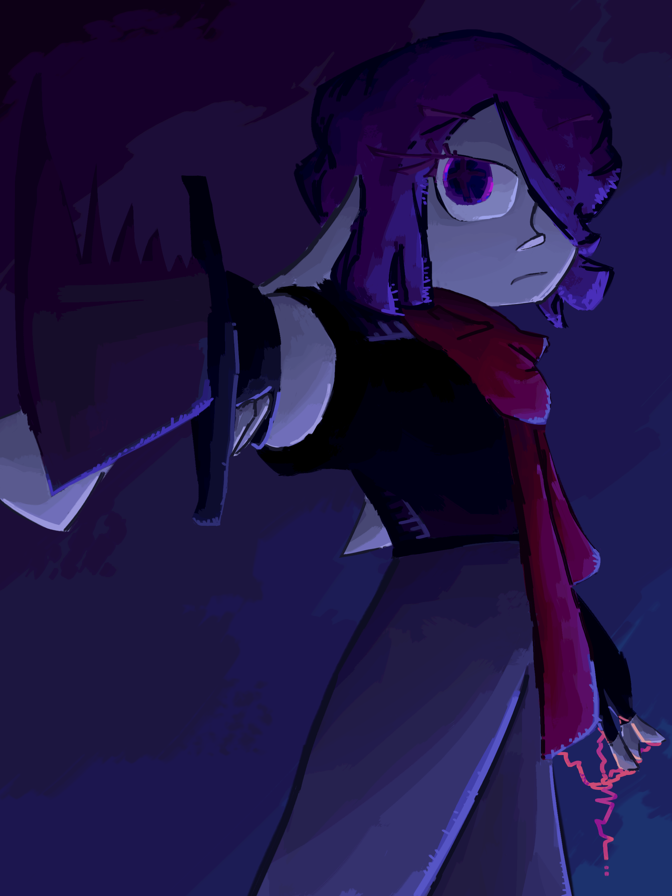
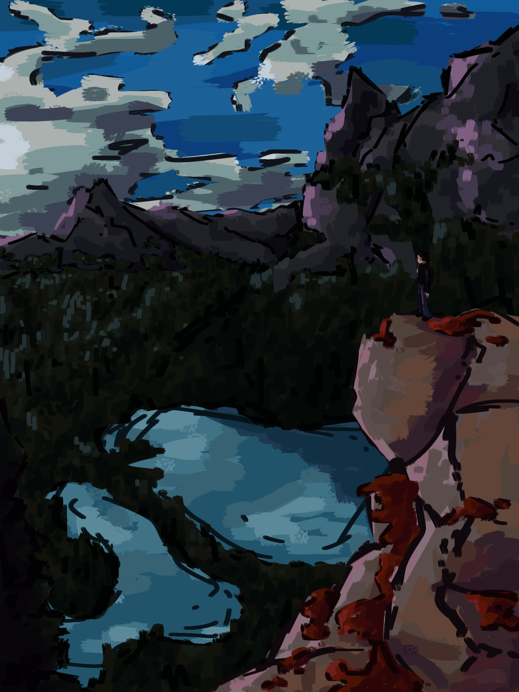

# Art

Sorted newest first

## plot significant possibly illustration
06/04/2025

might use this in [Chronicles of the Aethein](https://ratseerofrattesse.github.io/COAWiki). digitized version of below

## plot significant sketch
06/29/2025

drew this while in china

## epic golf club battle
06/18/2025

was playing mini golf with some friends when they started dramatically stabbing each other with the clubs

## style bullshittery
06/11/2025

ari looks fine and bia looks like a demon ;-;

## its murdering time
06/07/2025

zooooooommmmmm

## wooterfall
05/29/2025

and don't talk about the sunrays istg

## swoop
05/25/2025

swooop

## more slop action pieces
05/20/2025

feels oversaturated but its fineeeeee

## professionals
05/20/2025

would go hard on a tshirt

## overuse of textured blender
05/12/2025

idk where this fits into the story but it looks cool

## i am not sleep deprived
05/10/2025

recently stayed up till 4 to binge both seasons of arcane, amazing show

this is a redraw of that scene when jinx throws silko's corpse into the lake

## anatomy testing
05/09/2025

wanted to try to integrate actually semi-realistic anatomy into my style, doesnt look half bad i think

## stylization failure
05/09/2025

tried to redraw some faces, they all look completely different :(

## rando characters
05/05/2025

got bored so i drew a colour wheel of random characters, limiting myself to one per franchise

we got circe parsons, ingressus voltaris, jason asano, cyn, melancholy, alyss nightcrest, ponder, and ofc my oc ari :D

## 0:
05/04/2025

shitpost

## gifs :/
some friends saying catchphrases
05/022025

## we need YOU for the COOB
04/22/2025

join the coob
character is IC-0n from Internecion Coob

## clouds and schizz
04/16/2025

painted this bcz i wanted a new desktop bg
[inspiration](https://www.pinterest.com/pin/1009650810217270949/)

## spooky shadow demon
04/07/2025

if you don't recognize what this is a repaint of I am severely disappointed

diary of an 8-bit warrior, book 6 cover repaint

## overcooked ari
03/28/2025

more rendering practice, think i lost some of the style with this tho
too much blending

## map of kaaldenvale
03/25/2025

a map of kaaldenvale, the current setting for my story [chronicles of the aethein](https://rentry.co/ratseerofrattesse_chronicles_of_the_aethein)

## hello
03/23/2025

doodled this at two in the morning, yes i have a problem

## silly goober
03/23/2025

even MORE rendering practice. redraw of a frame from murder drones episode 8

[speedpaint](../assets/img/timelapses/dropped%20this%2C%20silly.mp4)

## ahhhhhh ari
03/18/2025

rendering practice again :0

[speedpaint](../assets/img/timelapses/ari%20float%20..D.mp4)

## plants :D
03/15/2025

wanted to do some traditional art for once lol

now that i look back at the reference it might be AI tho :(

[reference](https://www.pinterest.com/pin/68748327888/)

## hi there
03/15/2025

drew this to practice fine rendering a little more. the eye looks kinda off but its fiiineeeeee.

[speedpaint](../assets/img/timelapses/stab.mp4)

## AHHHHH IM GONNA DIE
03/13/2025

animation looks kinda goofy lol

[speedpaint](../assets/img/timelapses/get%20deleted.mp4)

## bozos in the city
03/07/2025

saw a poggers reference on pinterest and thought it perfectly reflected ari and bia's dynamic, so here this is

[reference](https://www.pinterest.com/pin/281543723892336/)

## coa trailer storyboard
02/26/2025
[link](https://file.garden/Zi28N2lFSSn-KxkR/art/coa%20trailer%20thingity%20storyboard.mp4)

so theoretically if my book was a movie 0:

not done, i will colour this at some point

reference taken from: SAD-ist, lazyeule, random walk cycles and birds on pinterest

## math lady
02/24/2025

needed a bg for my math presentation lol

## ahhhh crazy person
02/23/2025

decided i needed to do a better splash art for ari cuz the old one looks kinda bad now

## lloyd expressions
02/22/2025

lloyd makes faces

## ari expressions
02/22/2025

ari makes faces

## this thing that i referenced from a yt video
02/14/2025

saw this video by Yosho and really liked the thumbnail so i drew it in my style

[reference](https://www.youtube.com/watch?v=olfLeYBw0YU)

## not still life
02/12/2025

found some pogging looking flowers and wanted to draw flowers

[reference](https://www.pinterest.com/pin/155303888169969711/)

## lake o'hara
02/11/2025

i went to lake o'hara a few summers ago and today i wanted to do a nature painting so i made this

[speedpaint](../assets/img/timelapses/hiker.mp4)

## photosynthesis project
02/10/2025

[link](../assets/img/art/photosynthesis%20and%20cellular%20respiration%20animation.mp4 "kooky science bullshit")

a science project for school. we had to visually explain photosynthesis and cellular respiration. Kinda sad that this is my first coloured animation.

## goat
01/29/2025

f l o w e r ?

EAT

## zoooom
1/22/2025

sketch was made for a school project, liked the sketch so i imported it onto my laptop and rendered it. this is the first time ive used a non-normal layer blending mode in several months

recording!!! sketch isnt here cuz i did that on paper

[speedpaint](../assets/img/timelapses/zoooom.mp4)

## redoooo
1/22/2025

redo of an old piece bcz i need another new bg and my old art style had the stupid rough brushstrokes. once again the composition, idea, and perspective of this piece were both taken from a person nicknamed eclipse on discord. not gonna put their actual username here bcz im not sure if thats a violation of privacy or not

also did a recording this time, except i forgot to record the flats and rendering grim

[speedpaint](../assets/img/timelapses/negative%20character%20arc%20pog.mp4)

## sit
1/17/2025

wanted to draw something cute

also colour experimentation

## get deleted bozo
1/16/2025

made this purely because i needed a new bg that didn't have ugly ahh brushstrokes

## gay garlic
12/30/2024

so we named our group chat 'gay garlic' and i made a logo for it. don't ask. and this isnt sposed to offend anyone ok thank you

## avatar :D
12/29/2024

really refining my style now. i've drawn the colours in with no lineart in mind, and instead put the lineart layer behind the colours to add to the messy effect. this guy is gonna be my avatar - i basically just took all my favourite design features and dumped in here

## TO STOP ME RAHHHHHHHHHH (-sune)
12/28/2024

i turned part of the final sequence of songs of war into a comic cuz i was bored. here ya go. i went PAINTERLY PAINTERLY with the colours and without lineart it actually looks halfway decent but also completely unviewable at the same time

and without lineart

## o7 random plot device
12/27/2024

an illustration of the ending of puppetgame 2. ponder boutta blow the schizz out of a planet

## minor perspective work
12/19/2024

i should stop using so much folly red. the composition, idea, and perspective of this piece were both taken from a person nicknamed eclipse on discord. not gonna put their actual username here bcz im not sure if thats a violation of privacy or not

## The Eye of Claus
12/19/2024

[The Eye of Claus](../assets/img/art/The%20Eye%20of%20Claus.mp4)

for an open-ended winter-themed art project at school. concept: santa is secretly an eldritch demon. music is "Uzi Doesn't Read the Assignment" by AJ Dispirito

## genocide robot
12/14/2024

drew v from murder drones in this weird graphic style, think it turned out pretty cool

## cozy fire
12/12/2024

went wayyyy more painterly with the colours so without lineart this is an abomination

## ahhhh rimlight
12/07/2024

made this with inspiration from some elements of saboten's style (yes, the guy who illustrates diary of an 8-bit warrior)

version with no lineart or bg. looks kinda cool so i thought id put this here

## yo lighting
11/28/2024

actual good lighting??? impossible

## sketches of friends playing badminton
11/15/2024

yapper vs gossip man

science guy vs alleged pdf

## a portrait
11/04/2024

ari has seen unspeakable horrors. first actual attempt of colour grading

## oooh city
11/03/2024

first digital background. thsi is the city of avertine from chronicles of the aethein, its the capital of haelcrien.

## sketch of the art below
11/02/2024

outlook over a capital city

## colour practice
10/28/2024

some spooky bone thing + aryon's face + branch + COOB. first instance of me actually having an art style i think

## marker drawings of characters from my project chronicles of the aethein (see profile)
10/19/2024

character ari. apathetic mildly utilitarian bozo

character grim. will laugh while sewing your organs into your facial structure

character bia. optimistic comedian

## lvatober day 2
10/11/2024

drawing of kali for lvatober day 2. some errors in the fog, also looks a bit squished

## a ton of murder drones fanart
07/15/2024

this looks absolutely terrible :(