# Art

-   :material-flag:{ .lg .middle } __Welcome to the GALLERY!__

    ---

    This place houses all the art I've made that I deem worthy of showing on the internet. Have a browse! Click on any image for easier navigation and some kooky descriptions. They're all sorted newest first.

-   :material-flag:{ .lg .middle } __Animations__

    ---

    Unfortunately, I can't lightbox videos, so my bigger animations have been moved to another page. Just a few so far, but they're pretty goof :D

    [:octicons-arrow-right-24: Animations](Animations.md)

-   :material-sphere:{ .lg .middle } __What's Our Deities of Dreadful Ineptitude?__

    ---

    Try taking a look at tab labelled it up on the navigator bar. But I've also got these illustrations for the series here!

    [:octicons-arrow-right-24: ODODI Chapter Illustrations](ODODI%20Chapter%20Illustrations.md)

-   :material-vector-triangle:{ .lg .middle } __Too many words!__

    ---

    Too much commitment! I say, offering a very slowly and unpredictably updating comic version of the book.

    [:octicons-arrow-right-24: ODODI Comic](ODODI%20Comic.md)

-   :material-vector-triangle:{ .lg .middle } __Can I has moar ODODI stuff?__

    ---

    Here's some concept art I made! Not much so far, but probably more coming...

    [:octicons-arrow-right-24: ODODI Concept Art](ODODI%20Concept%20Art.md)

-   :material-scale-unbalanced:{ .lg .middle } __Show me SATIRE SHIT__

    ---

    Right down here. The Seven Deadly Insecurities - the seven deadly sins, but my friends stole their jobs.

    [:octicons-arrow-right-24: The Seven Deadly Insecurities](The%20Seven%20Deadly%20Insecurities.md)

Sorted newest first

Click images for more info and better nav.

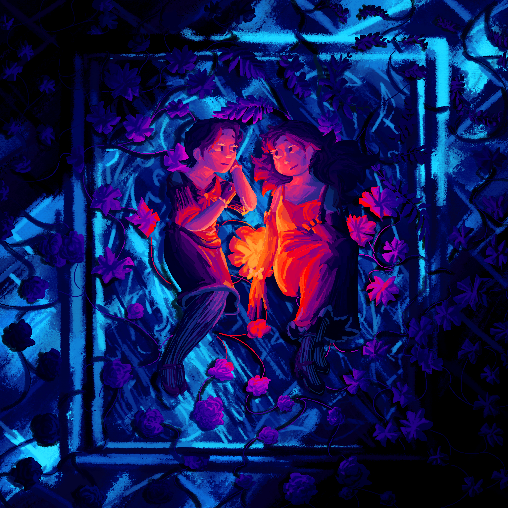{ data-title="bloom" data-description=".bloom" data-caption-position="right"}

    
<em>02/08/2026</em>

  
this all came out of one of the hytale beds being a stone cold ritual altar

  
totally forgot to put the blue light on the characters but whateverrrrr

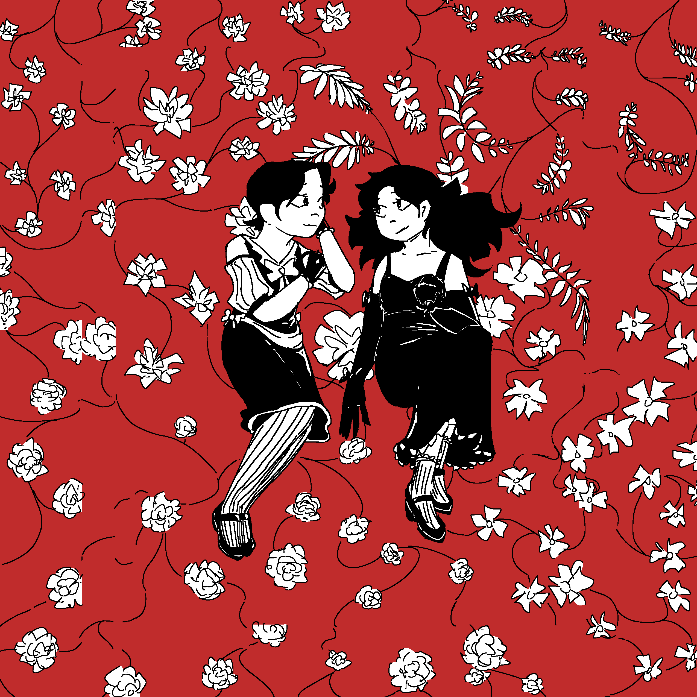{ data-title="bloom retro" data-description=".bloomretro" data-caption-position="right"}

    
<em>02/07/2026</em>

  
retro black and white looking version of the one above, thought it looked nice

{ data-title="ONE POSTER" data-description=".oneposter" data-caption-position="right"}

    
<em>11/26/2025</em>

  
Drew this and put it on a displate because I have too much digital art and no way to put it up on a wall.

  
Please someone here get the reference.

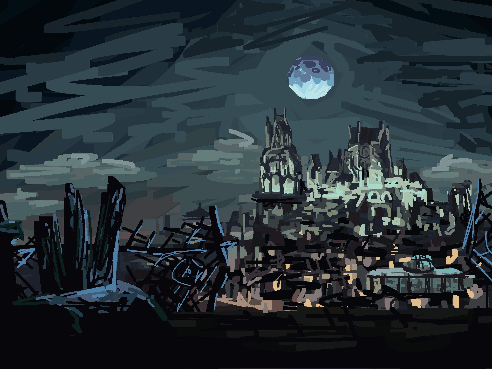{ data-title="Piltover" data-description=".piltover" data-caption-position="right"}

    
<em>11/23/2025</em>

    
Study of a shot from Arcane. Super rough cuz I'm super lazy.

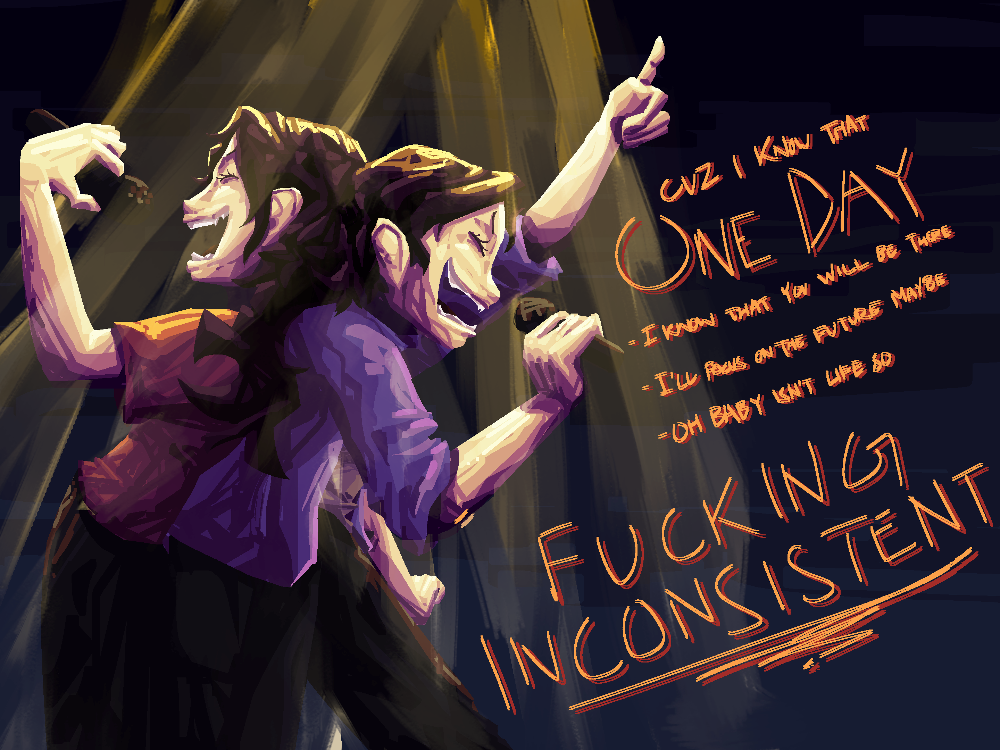{ data-title="FUCKING INCONSISTENT" data-description=".FUCKINGINCONSISTENT" data-caption-position="right"}

    
<em>11/22/2025</em>

    
LVJY's my fav band >:D, so I drew some bozos singing what I think is one of their best songs.

{ data-title="Carpfire Cuddles" data-description=".carpfire" data-caption-position="right"}

    
<em>11/22/2025</em>

    
they burned all the marshmallows, but i've repented for my sins

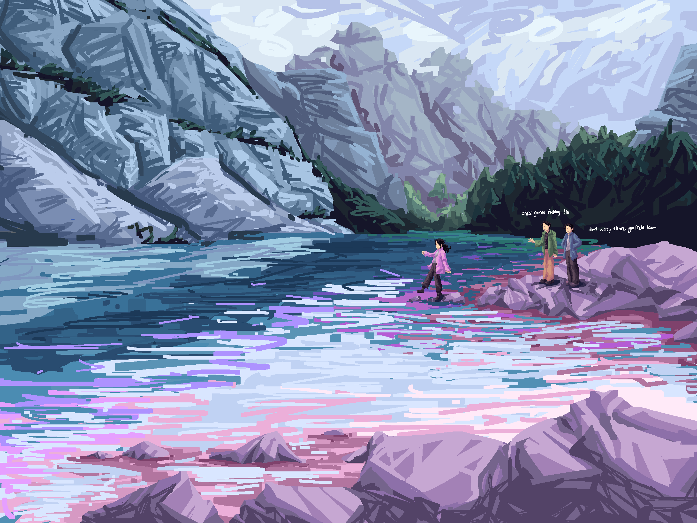{ data-title="Live Laugh Lasagna" data-description=".livelaughlasagna" data-caption-position="right"}

    
<em>11/05/2025</em>

    
The Company has arrived at another place to potentially off themselves by comedic timing. They're either living or laughing and it's gonna have lasagna on the side.

    
I apologize for that description, fever dreams are my default mental state.

    
Guess the location, if ya want.

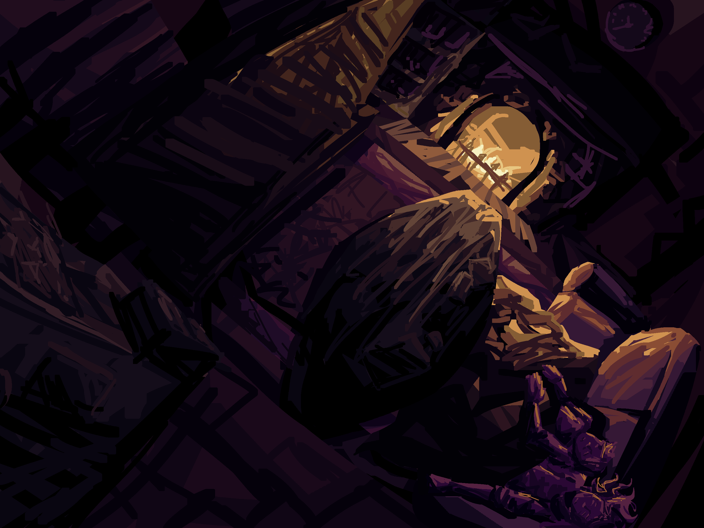{ data-title="It's 3:45 (AM!)" data-description=".eepy" data-caption-position="right"}

    
<em>11/03/2025</em>

    
cozy drawing, wonder what rat and berry fell asleep to

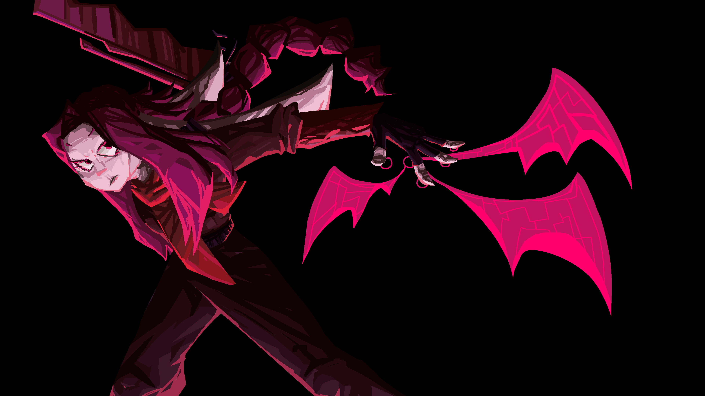{ data-title="ODODI Teaser Shot 1" data-description=".ododiteasers1" data-caption-position="right"}

    
<em>10/24/2025</em>

    
Working on a little promo anim for my book, here's the first shot I got

    
Inevitably going to give up later :P

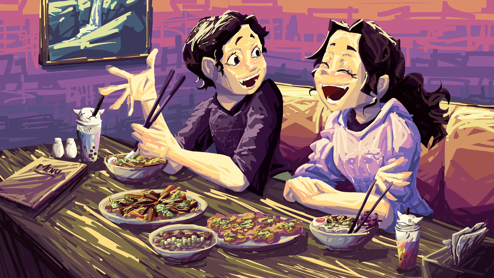{ data-title="Goobers at Dinner" data-description=".fooood" data-caption-position="right"}

    
<em>10/13/2025</em>

    
Emo Rat and Strawberry Shortcake massacred a restaurant and stole the food. Don't worry 'bout it.

    
Based on: <a href="https://erinshin.com/projects/PmKvDr">https://erinshin.com/projects/PmKvDr</a>

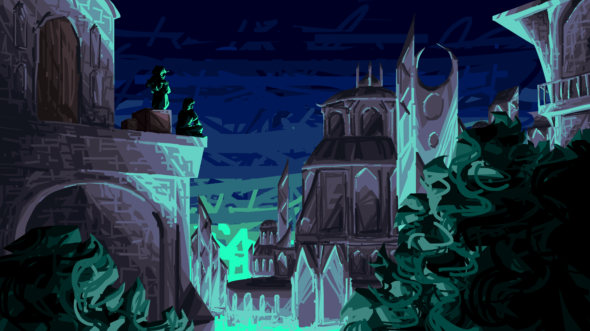{ data-title="Stargazing" data-description=".stargazing" data-caption-position="right"}

    
<em>10/08/2025</em>

    
Emo Rat and Strawberry Shortcake dramatically observe a big fantasy citadel in the distance. What lies inside? This writer doesn't know as he's too lazy to write it.

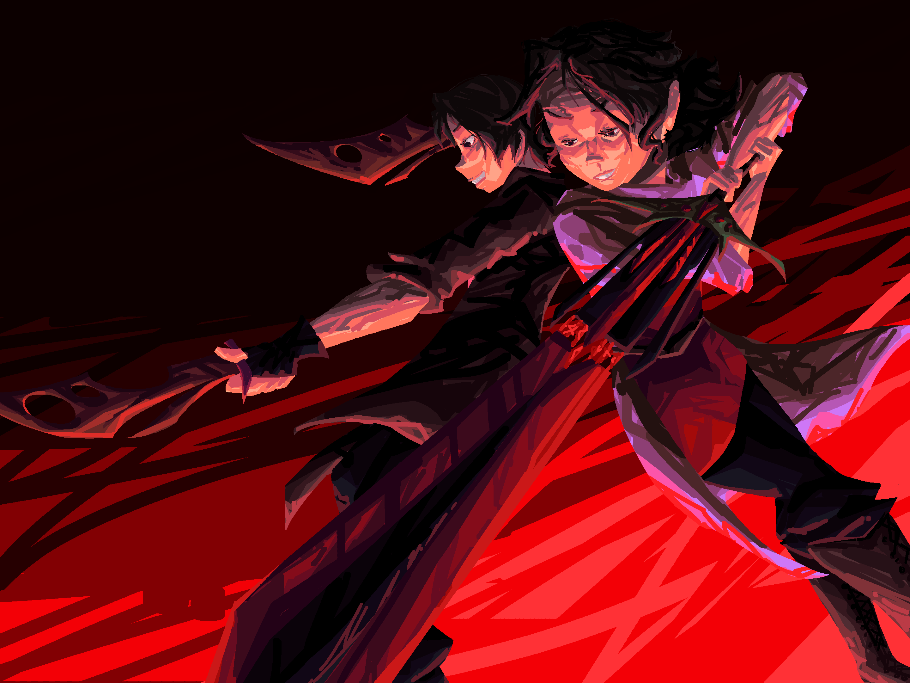{ data-title="BADASSERY" data-description=".BADASSERY" data-caption-position="right"}

    
<em>10/02/2025</em>

    
Emo Rat and Strawberry Shortcake take on some offscreen threat with blood red adventuring STYLE.

{ data-title="we're so back" data-description=".weresoback" data-caption-position="right"}

    
<em>09/15/2025</em>

    
Bestttt friends.

    
Why's the lighting so eerie? No idea. They'd never be murdered and buried in the bog somewhere, that's crazy.

{ data-title="Lasagne Behaviour" data-description=".lasagnebehaviour" data-caption-position="right"}

    
<em>09/12/2025</em>

    
garfield kart is better than mario kart, fight me

{ data-title="Angry Fae Quarrel Over Useless Character Conflict" data-description=".angy" data-caption-position="right"}

    
<em>09/09/2025</em>

    
Ari and Bia are doing fine. No need to ask them! As you can tell, their relationship is perfectly healthy.

    
for anyone who saw the last artwork: i did not end up working on the big stuff

    
this was inspired by <a href="https://www.zeniyan.com/?pgid=k7hal0g0-3f54f2de-1b50-4677-905b-930e4cdd3718">a piece by zeniyan</a>

{ data-title="Seaside" data-description=".seaside" data-caption-position="right"}

    
<em>09/04/2025</em>

    
just a cute appetizer piece for me before going back to work on big stuff

    
The Company has for some reason decided to go walking outside on the coast in the middle of the night for no apparent reason.

{ data-title="Animation Practice" data-description=".animprac" data-caption-position="right"}

    
<em>07/16/2025</em>

    
Made to test how much animation I could get done while full-colouring.

    
This took 4 days. Suffice to say, won't be doing much full colour animation anytime soon.

    
(i then proceeded to make a minute long animated short for my friend's birthday in seventeen days)

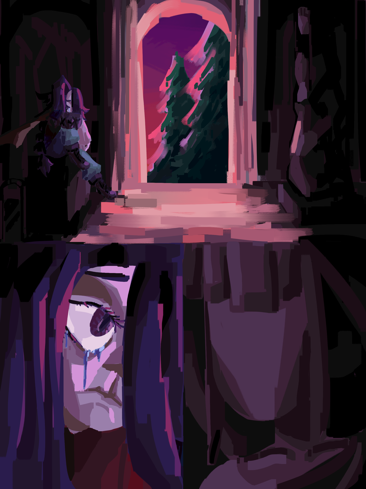{ data-title="plot significant possibly illustration" data-description=".plotsignificant" data-caption-position="right"}

    
<em>07/04/2025</em>

    
might use this in [Our Deities of Dreadful Ineptitude](https://ratseerofrattesse.github.io/ODODIWiki). digitized version of below`

{ data-title="plot significant sketch" data-description=".plotsignificantsketch" data-caption-position="right"}

    
<em>06/29/2025</em>

    
drew this while in china cuz i was super bored and didnt bring laptop

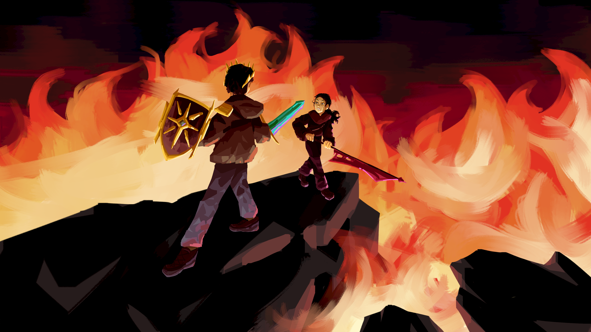{ data-title="Old Man Arson" data-description=".golfclub" data-caption-position="right"}

    
<em>06/18/2025</em>

    
was playing mini golf with some friends when they started dramatically stabbing each other with the clubs

    
Strawberry Shortcake has failed to stop the Old Man from burning mysterious rocky outcropping in the middle of nowhere. Badass duel with 2000s nightcore imminent.

ari looks fine and bia looks like a demon ;-;

{ data-title="its murdering time" data-description=".zoom" data-caption-position="right"}

    
<em>06/07/2025</em>

    
ari and bia boutta go off on a killing spree - people or monsters? who cares

    
zooooooommmmmm

{ data-title="Eastbound and Down" data-description=".wooterfall" data-caption-position="right"}

    
<em>05/29/2025</em>

    
and don't talk about the sunrays istg ive heard enough about those it took five fucking minutes oml

{ data-title="ONSLAUGHT" data-description=".onslaught" data-caption-position="right"}

    
<em>05/20/2025</em>

    
Epic clash of the fates! One demonic dysphorium sadist shit and one coward adventurer with plot armour! Who will win???

{ data-title="professionals" data-description=".professionals" data-caption-position="right"}

    
<em>05/20/2025</em>

    
this shit totally would go hard on a tshirt, someone make that

{ data-title="Menacing Building Standing" data-description=".buildingstanding" data-caption-position="right"}

    
<em>05/12/2025</em>

    
idk where this fits into the story but it looks cool

{ data-title="Jinx Self-Induces Photophobia" data-description=".underwater" data-caption-position="right"}

    
<em>05/10/2025</em>

    
recently stayed up till 4 to binge both seasons of arcane, amazing show

    
How is every fictional character able to hold their eyes open underwater??? Every time????

    
Painting study of a shot from Arcane. Went a little overboard with the lighting and also Jinx looks really old but its fineeee.

{ data-title="anatomy testing" data-description=".ariface" data-caption-position="right"}

    
<em>05/09/2025</em>

    
wanted to try to integrate actually semi-realistic anatomy into my style, doesnt look half bad i think

{ data-title="stylization failure" data-description=".catheadphones" data-caption-position="right"}

    
<em>05/09/2025</em>

    
tried to redraw some faces, they all look completely different :(

{ data-title="I am a nerd." data-description=".nerdwheel" data-caption-position="right"}

    
<em>05/05/2025</em>

    
got bored so i drew a colour wheel of random characters, limiting myself to one per franchise

    
we got circe parsons, ingressus voltaris, jason asano, cyn, melancholy, alyss nightcrest, ponder, and ofc my oc ari :D

{ data-title="0:" data-description=".shitpost" data-caption-position="right"}

    
<em>05/04/2025</em>

    
shitpost. why else would you make shit art if you don't shitpost?

{ data-title="we need YOU for the COOB" data-description=".jointhehive" data-caption-position="right"}

    
<em>04/22/2025</em>

    
JOIN THE HIVE

    
JOIN THE HIVE

    
JOIN THE HIVE

    
Fanart of Liam Vickers' Internecion Cube. Go watch it it's incredible.

{ data-title="ADVENTURE AHAHAHAHAH" data-description=".adventure" data-caption-position="right"}

    
<em>04/16/2025</em>

    
painted this bcz i wanted a new desktop bg

    
<a href="https://www.pinterest.com/pin/1009650810217270949/">inspiration</a>

{ data-title="spooky shadow demon" data-description=".doa8bw" data-caption-position="right"}

    
<em>04/07/2025</em>

    
if you don't recognize what this is a repaint of I am severely disappointed

    
diary of an 8-bit warrior, book 6 cover repaint

{ data-title="overcooked ari" data-description=".reptile" data-caption-position="right"}

    
<em>03/28/2025</em>

    
more rendering practice, think i lost some of the style with this tho

    
too much blending

{ data-title="map of kaaldenvale" data-description=".map" data-caption-position="right"}

    
<em>03/25/2025</em>

    
a map of kaaldenvale, the current setting for ODODI

{ data-title="hello" data-description=".hello" data-caption-position="right"}

    
<em>03/23/2025</em>

    
doodled this at two in the morning, yes i have a problem

{ data-title="Dropped this, Silly." data-description=".droppedthissilly" data-caption-position="right"}

    
<em>03/20/2025</em>

    
even MORE rendering practice. redraw of a frame from murder drones episode 8

    
timelapse:

    <video style="position:relative;width:100%;height:100%" controls="" alt="type:video"><source src="../assets/img/timelapses/dropped%20this%2C%20silly.mp4" type="video/mp4"></video>

{ data-title="GLARE" data-description=".glare" data-caption-position="right"}

    
<em>03/18/2025</em>

    
rendering practice again :0

    
timelapse:

    <video style="position:relative;width:100%;height:100%" controls="" alt="type:video"><source src="../assets/img/timelapses/ari%20float%20..D.mp4" type="video/mp4"></video>

{ data-title="flowers" data-description=".flowers" data-caption-position="right"}

    
<em>03/15/2025</em>

    
wanted to do some traditional art for once lol

    
now that i look back at the reference it might be AI tho :(

    
<a href="https://www.pinterest.com/pin/68748327888/">reference</a>

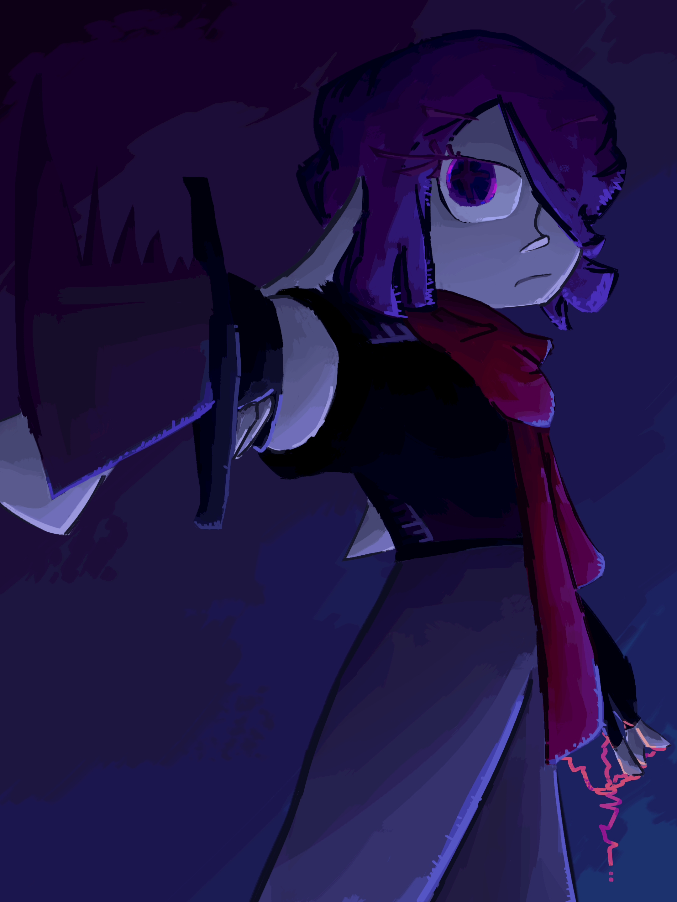{ data-title="stab" data-description=".stab" data-caption-position="right"}

    
<em>03/15/2025</em>

    
drew this to practice fine rendering a little more. the eye looks kinda off but its fiiineeeeee.

    <video style="position:relative;width:100%;height:100%" controls="" alt="type:video"><source src="../assets/img/timelapses/stab.mp4" type="video/mp4"></video>

{ data-title="AHHHHH IM GONNA DIE" data-description=".splitscreen" data-caption-position="right"}

    
<em>03/13/2025</em>

    
animation looks kinda goofy lol

    <video style="position:relative;width:100%;height:100%" controls="" alt="type:video"><source src="../assets/img/timelapses/get%20deleted.mp4" type="video/mp4"></video>

{ data-title="math lady" data-description=".mathlady" data-caption-position="right"}

    
<em>02/24/2025</em>

    
I have a vendetta against Canva yet also want my presentations to look artsy, so of course the obvious solution was to repaint memes and use em as slide backgrounds.

{ data-title="lloyd expressions" data-description=".lloyd" data-caption-position="right"}

    
<em>02/22/2025</em>

    
lloyd makes faces, drawn in one of my old sketchbooks

{ data-title="ari expressions" data-description=".ari" data-caption-position="right"}

    
<em>02/22/2025</em>

    
ari makes faces, drawn in one of my old sketchbooks

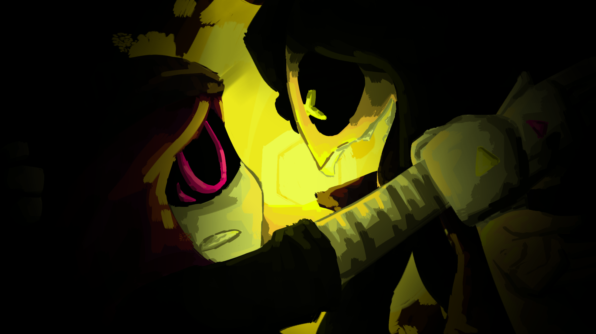{ data-title="RAHHHHHH" data-description=".cynner" data-caption-position="right"}

    
<em>02/14/2025</em>

    
saw this video by Yosho and really liked the thumbnail so i drew it in my style

    
<a href="https://www.youtube.com/watch?v=olfLeYBw0YU">reference</a>

{ data-title="not still life" data-description=".flowerpot" data-caption-position="right"}

    
<em>02/12/2025</em>

    
found some pogging looking flowers and wanted to draw flowers

    
<a href="https://www.pinterest.com/pin/155303888169969711/">reference</a>

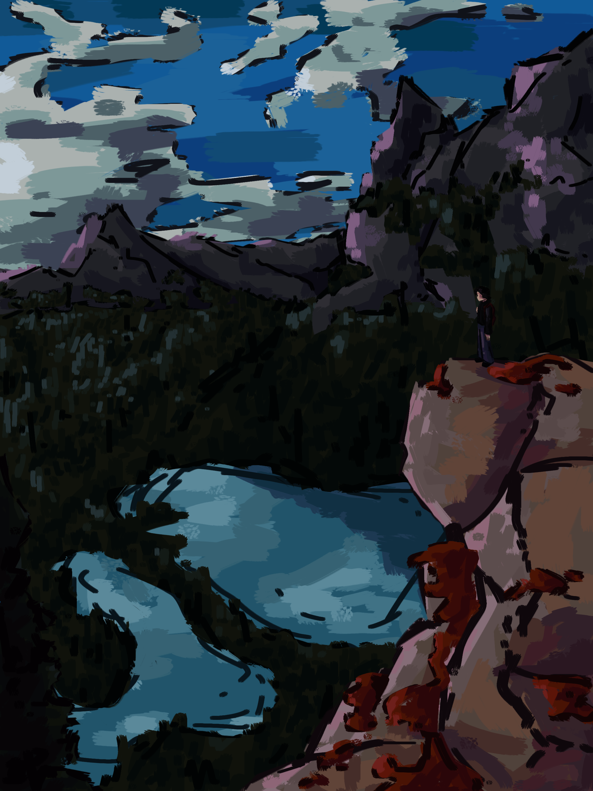{ data-title="lake o'hara" data-description=".ohara" data-caption-position="right"}

    
<em>02/11/2025</em>

    
i went to lake o'hara a few summers ago and today i wanted to do a nature painting so i made this

    
timelapse:

    <video style="position:relative;width:100%;height:100%" controls="" alt="type:video"><source src="../assets/img/timelapses/hiker.mp4" type="video/mp4"></video>

{ data-title="goat" data-description=".goat" data-caption-position="right"}

    
<em>01/29/2025</em>

    
f l o w e r ?

    
EAT

    
made for a science proejct on photosynthesis, you can find that animation on the animations page

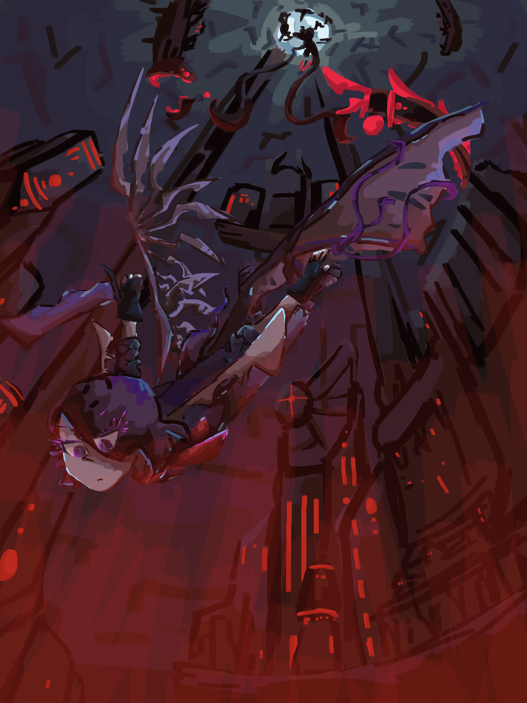{ data-title="zoooom" data-description=".hellhole" data-caption-position="right"}

    
<em>01/22/2025</em>

    
sketch was made for a school project, liked the sketch so i imported it onto my laptop and rendered it. this is the first time ive used a non-normal layer blending mode in several months

    
recording!!! sketch isnt here cuz i did that on paper

    <video style="position:relative;width:100%;height:100%" controls="" alt="type:video"><source src="../assets/img/timelapses/zoooom.mp4" type="video/mp4"></video>

{ data-title="redoooo" data-description=".negativearc" data-caption-position="right"}

    
<em>01/22/2025</em>

    
redo of an old piece bcz i need another new bg and my old art style had the stupid rough brushstrokes. once again the composition, idea, and perspective of this piece were both taken from a person nicknamed eclipse on discord. not gonna put their actual username here bcz im not sure if thats a violation of privacy or not

    
also did a recording this time, except i forgot to record the flats and rendering grim

    <video style="position:relative;width:100%;height:100%" controls="" alt="type:video"><source src="../assets/img/timelapses/negative%20character%20arc%20pog.mp4" type="video/mp4"></video>

{ data-title="ari sit" data-description=".sit" data-caption-position="right"}

    
<em>01/17/2025</em>

    
wanted to draw something cute, also some colour experimentation

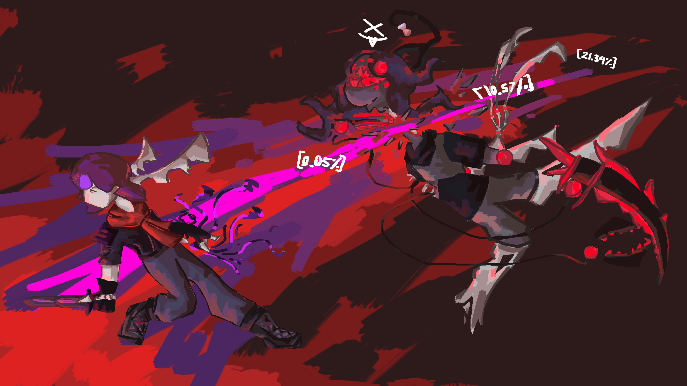{ data-title="BANG" data-description=".bang" data-caption-position="right"}

    
<em>01/16/2025</em>

    
made this purely because i needed a new bg that didn't have ugly ahh brushstrokes

{ data-title="gay garlic" data-description=".gaygarlic" data-caption-position="right"}

    
<em>12/30/2025</em>

    
so we named our group chat 'gay garlic' and i made a logo for it. don't ask. and this isnt sposed to offend anyone ok thank you

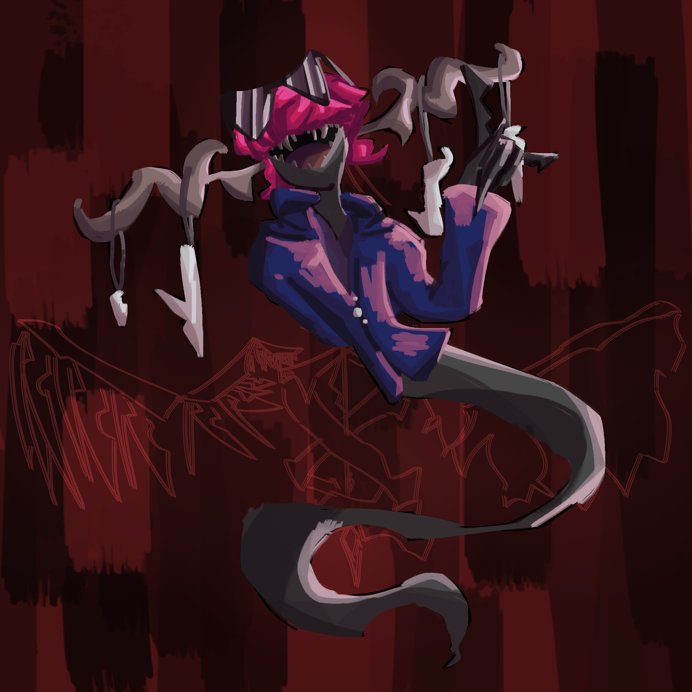{ data-title="avatar :D" data-description=".avatar" data-caption-position="right"}

    
<em>12/29/2025</em>

    
really refining my style now. i've drawn the colours in with no lineart in mind, and instead put the lineart layer behind the colours to add to the messy effect. this guy is gonna be my avatar - i basically just took all my favourite design features and dumped in here

{ data-title="TO STOP ME RAHHHHHHHHHH (-sune)" data-description=".songsofwar" data-caption-position="right"}

    
<em>12/28/2025</em>

    
i turned part of the final sequence of songs of war into a comic cuz i was bored. here ya go. i went PAINTERLY PAINTERLY with the colours and without lineart it actually looks halfway decent but also completely unviewable at the same time

{ data-title="TO STOP ME RAHHHHHHHHHH (-sune) (no lines)" data-description=".songsofwarnoline" data-caption-position="right"}

    
<em>12/28/2025</em>

    
and without lineart

{ data-title="But that was all preroll footage..." data-description=".plotdevices" data-caption-position="right"}

    
<em>12/27/2025</em>

    
an illustration of the ending of puppetgame 2. ponder boutta blow the schizz out of a planet

{ data-title="minor perspective work" data-description=".eclipse" data-caption-position="right"}

    
<em>12/19/2025</em>

    
i should stop using so much folly red. the composition, idea, and perspective of this piece were both taken from a person nicknamed eclipse on discord. not gonna put their actual username here bcz im not sure if thats a violation of privacy or not

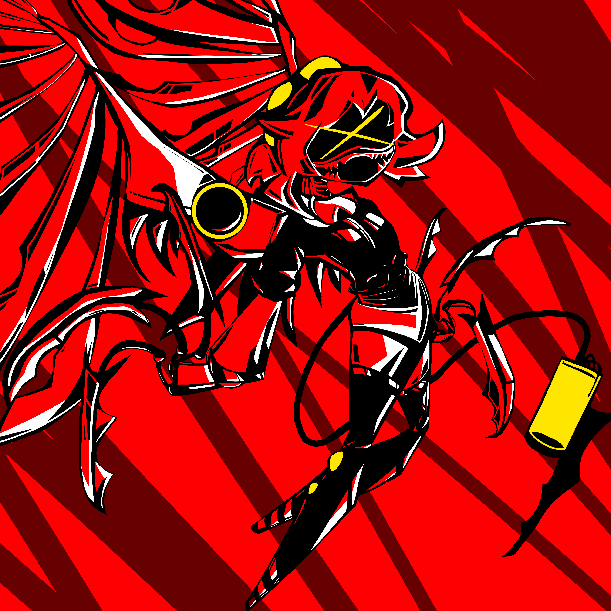{ data-title="genocide robot" data-description=".vmurder" data-caption-position="right"}

    
<em>12/14/2025</em>

    
drew v from murder drones in this weird graphic style, think it turned out pretty cool

{ data-title="cozy fire" data-description=".campfire" data-caption-position="right"}

    
<em>12/12/2025</em>

    
went wayyyy more painterly with the colours so without lineart this is an abomination

{ data-title="ahhhh rimlight" data-description=".rimlight" data-caption-position="right"}

    
<em>12/07/2025</em>

    
made this with inspiration from some elements of saboten's style (yes, the guy who illustrates diary of an 8-bit warrior)

{ data-title="ahhhh rimlight (no lines)" data-description=".rimlightnoline" data-caption-position="right"}

    
<em>12/07/2025</em>

    
version with no lineart or bg. looks kinda cool so i thought id put this here

{ data-title="im gonna kill your face and other organs too" data-description=".eatyou" data-caption-position="right"}

    
<em>11/28/2025</em>

    
actual good lighting??? impossible

{ data-title="Badminton Duel 1" data-description=".badminton1" data-caption-position="right"}

    
<em>11/15/2025</em>

    
friends playing badminton: the yapper vs the gossip man

{ data-title="Badminton Duel 1" data-description=".badminton2" data-caption-position="right"}

    
<em>11/15/2025</em>

    
friends playing badminton: the science guy vs the alleged pdfn

{ data-title="a portrait" data-description=".traumapog" data-caption-position="right"}

    
<em>11/04/2025</em>

    
ari has seen unspeakable horrors. first actual attempt of colour grading

{ data-title="Avertine" data-description=".avertine" data-caption-position="right"}

    
<em>11/03/2025</em>

    
first digital background. thsi is the city of avertine from Our Deities of Dreadful Ineptitude, its the capital of haelcrien.

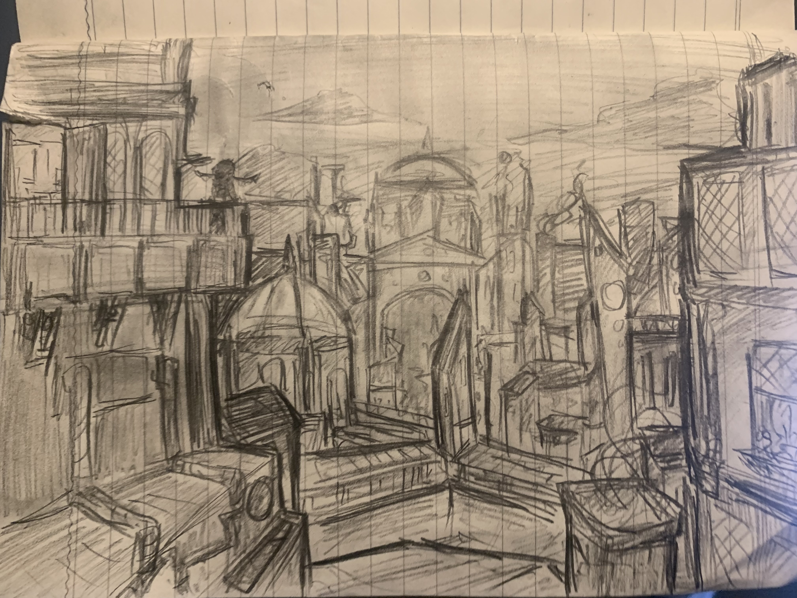{ data-title="Avertine Sketch" data-description=".avertinesketch" data-caption-position="right"}

    
<em>11/02/2025</em>

    
sketch of the other one, this sketchbook literally fell apart

{ data-title="colour practice" data-description=".clrpractice" data-caption-position="right"}

    
<em>10/28/2025</em>

    
some spooky bone thing + aryon's face + branch + COOB. first instance of me actually having an art style i think

## marker drawings of characters from my project Our Deities of Dreadful Ineptitude (see profile)
10/19/2024
{ data-title="Ari" data-description=".arimarker" data-caption-position="right"}

    
<em>10/19/2025</em>

    
character ari. apathetic mildly utilitarian bozo

{ data-title="Grim" data-description=".grimmarker" data-caption-position="right"}

    
<em>10/19/2025</em>

    
character grim. will laugh while sewing your organs into your facial structure

{ data-title="Bia" data-description=".biamarker" data-caption-position="right"}

    
<em>10/19/2025</em>

    
character bia. optimistic comedian, but also heart of gold ig

{ data-title="lvatober day 2" data-description=".lvatober" data-caption-position="right"}

    
<em>10/11/2025</em>

    
drawing of kali for lvatober day 2. some errors in the fog, also looks a bit squished

{ data-title="a ton of md fanart" data-description=".badart" data-caption-position="right"}

    
<em>07/15/2025</em>

    
this looks absolutely terrible :(

